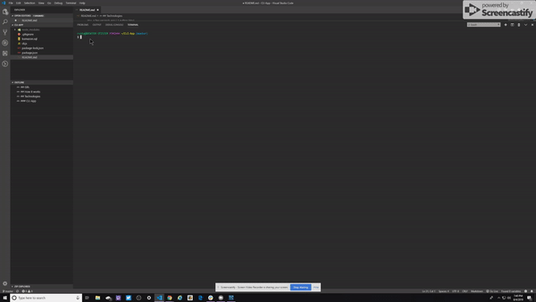
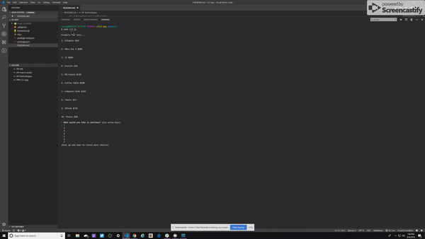
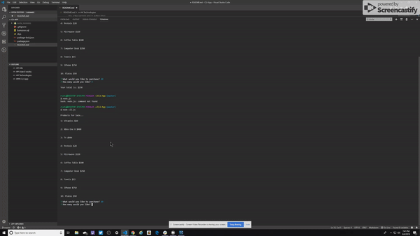

### CLI-App

My name is Craig McAlister. I was the lone contributor to this app.

This app is a virtual store.  The app has inventory you can purchase.  The inventory is stored in mySQL.
Anytime you purchase anything the inventory will be updated in my database. 

## How it works

* FIrst you have to have node installed on your PC.  If you don't, you can download it here https://nodejs.org/en/download/.

* Then go to my github https://github.com/CMack704/CLI-App.git, and clone my repo onto your PC.

* Once installed make sure to type npm i to install the dependancies from the package.json.

* CD into the file and type, node cli.js.  Then it will display a list of my inventory and ask what you would like to buy.
  To selsct what you want scroll up and down and select item id that you would like.

* Then it will ask how many you would like.  If you select more than I have it will ask you again how many you would like. 
  If you don't it will give you a total and end.

## Gifs 

## Technologies

* Javascript for the main language.
* mySQL for database
* node is used to run app
* inquirer for the prompts
* SQL for language in mySQL
